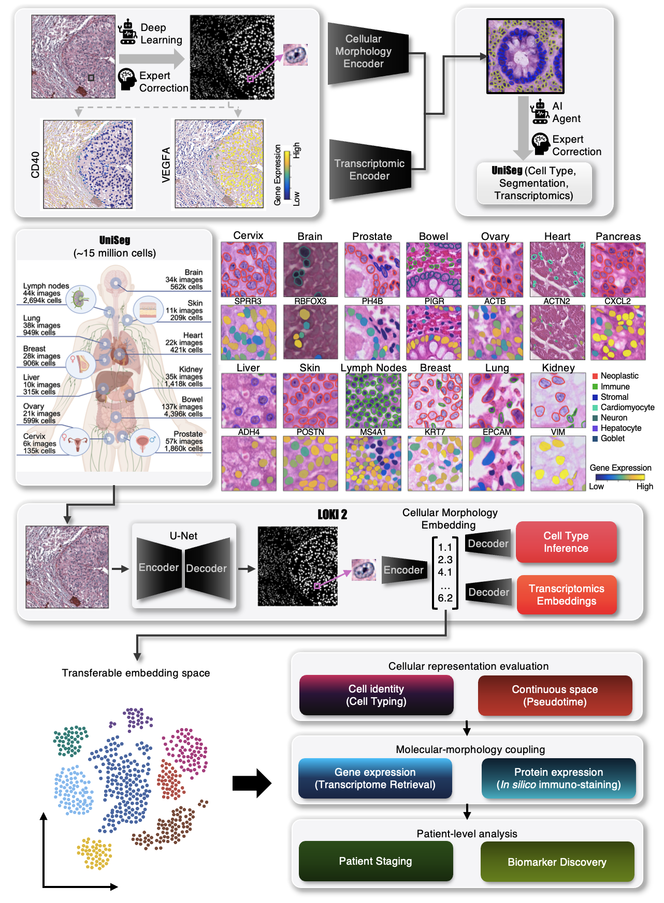

# Loki2

Loki2 is a single-cell pathology foundation model that uses an encoder–decoder architecture to translate nuclear morphology into molecular phenotype. Loki2 is trained on UniSeg, a pan-tissue resource of 15 million cells with paired segmentation and transcriptomic measurements from multiple spatial technologies. This training strategy enables three capabilities from H&E images alone: universal cell type inference, in silico spatial transcriptomics by retrieving transcriptionally matched cells from reference atlases, and continuous morphological pseudotime inference of cell state transitions. By aggregating single-cell features, Loki2 also supports whole-slide clinical tasks. These results show that routine histology contains far richer molecular and cellular information than previously recognized, and that Loki2 provides a general framework for accessing this information across tissues, disease contexts, and scales. 

The pre-train weights and source code will be released on GitHub and Hugging Face after the manuscript is accepted.


## User Manual and Notebooks
You can view the Loki2 website and notebooks [here](https://guangyuwanglab2021.github.io/pathweb/).
This README provides a quick overview of how to set up and use Loki2.


## Source Code
All source code for Loki2 is contained in the `./src/loki2` directory.

The source code will be released on GitHub and Hugging Face after the manuscript is accepted.


## Project Structure
Please organize your project folders as follows:

```
.
├── src/           # Source code for Loki2
├── model_ckpt/    # Pretrained Loki2 model weights
├── data/          # Input data files
├── notebooks/     # Jupyter notebooks for tutorials and examples
└── outputs/       # Output files and results
```


## Installation

1. **Create a conda environment**:
   ```bash
   conda env create -f environment.yaml
   conda activate loki2_env
   ```

2. **Navigate to the Loki source directory and install Loki2**:
   ```bash
   cd ./src
   pip install .
   ```


## Usage
Once Loki2 is installed, you can import it in your Python scripts or notebooks:
   ```python
   import loki2.preprocess
   import loki2.plot
   import loki2.retrieve
   import loki2.psdtime
   import loki2.immstain
   import loki2.mil
   ```


## Pretrained weights
The pretrained weights will be released on GitHub and Hugging Face after the manuscript is accepted.
